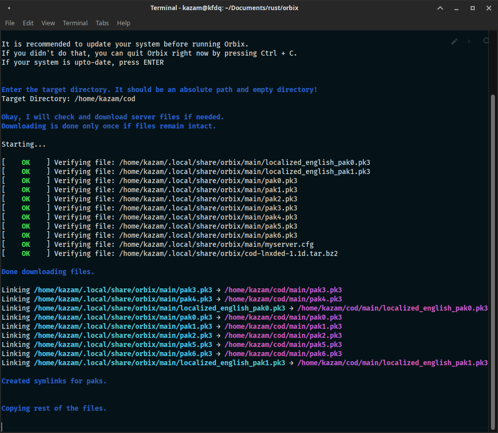
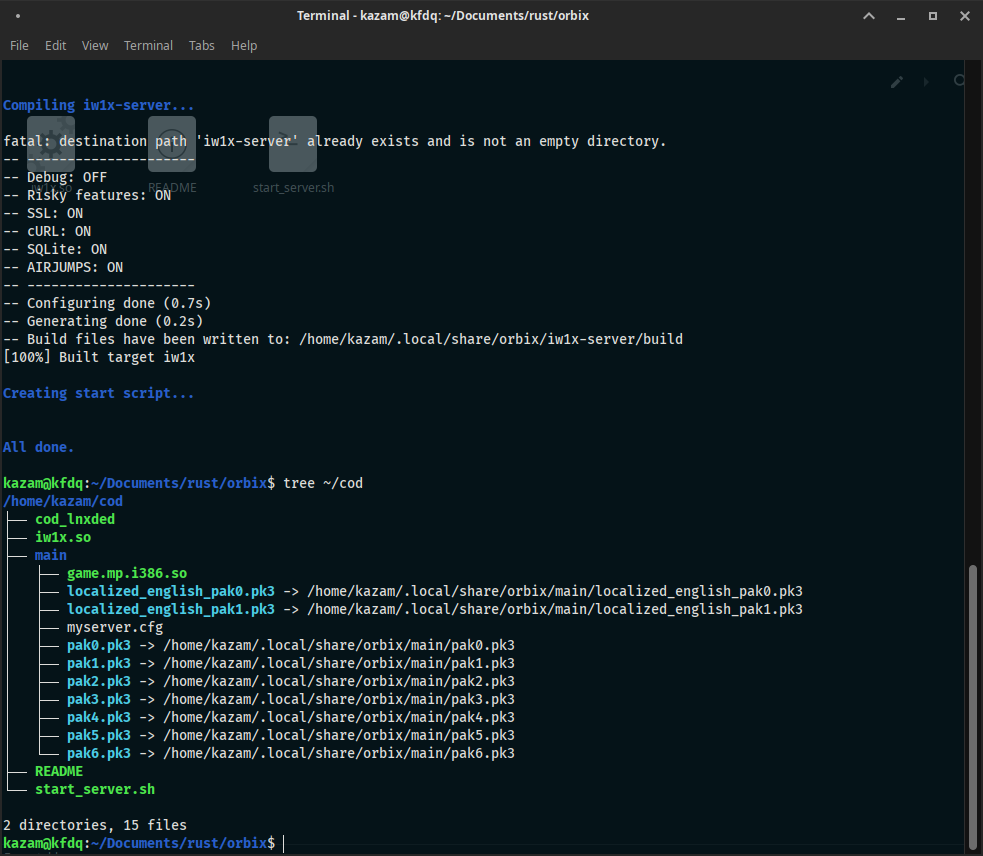
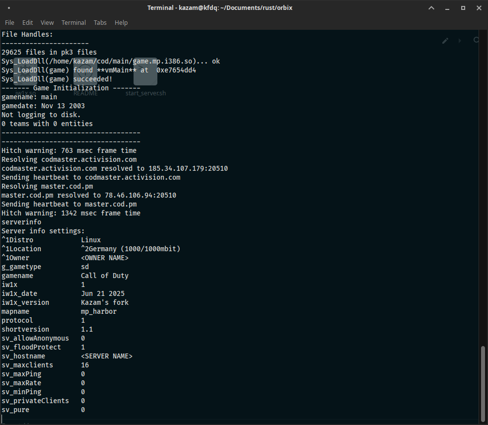

###### top-link

# Orbix
This is utility that automates the creation of Call of Duty ®️ (2003) servers ( currently v1.1 only).
It downloads and creates symlinks and copies of required files.
It also compiles and installs this fork of **iw1x-server**: https://github.com/coyoteclan/iw1x-server 

## Screenshots





## Installation
The best way to install on Debian/Ubuntu based systems is to add [our apt repository](https://github.com/Wolf-Pack-Clan/kOS-packages/).</br>
Then install the `orbix` package using `apt`.

```bash
sudo apt update
sudo apt install orbix
```
</br>

Arch Linux based distros are also supported but currently there are no packages. You can download binary files from the [release page](https://github.com/Wolf-Pack-Clan/orbix/releases).
